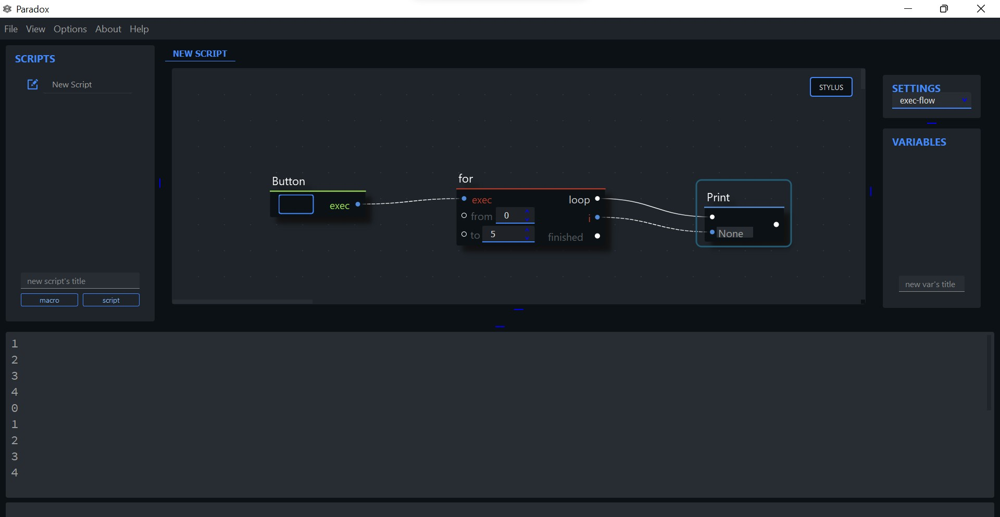
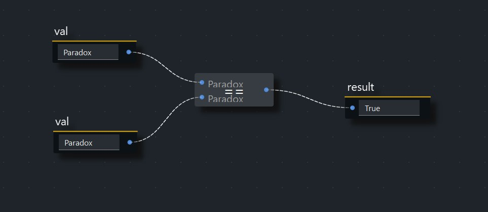
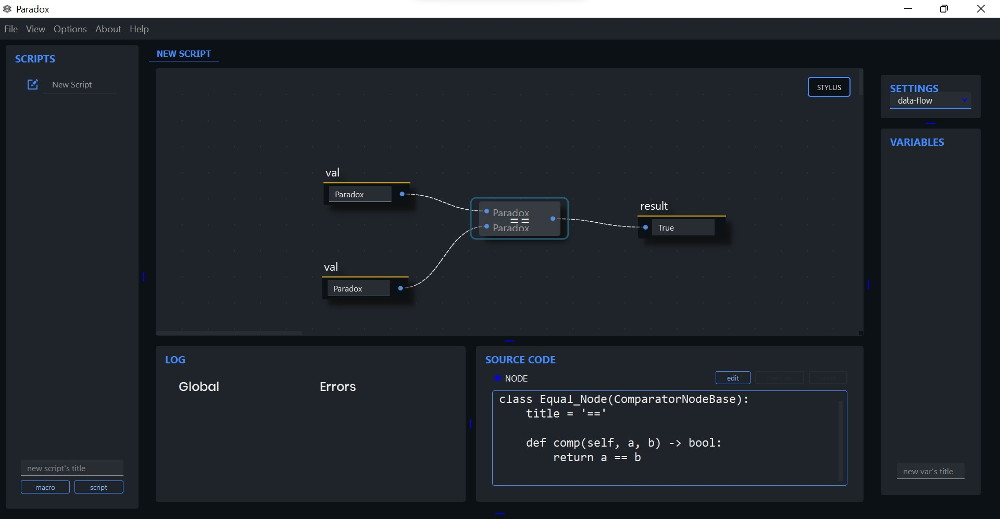
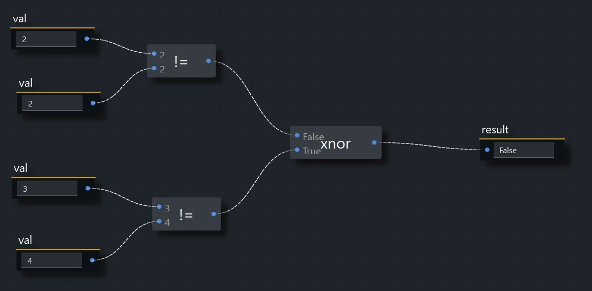

# Paradox
## Content

This document details what you will experience with Paradox. It will cover everything you need to know before getting started with Paradox; from the interface, to the features.

## Introduction

Paradox is a first of its kind software.  Paradox lets you use the more diagram-like, dataflow inspired structure to represent data processing-centric functionality. It is the next generation programming tool for everyone. Paradox is easily accessible and easy to use. It works in a diagram-like, data flow inspired structure to represent data processing-centric functionality. It uses nodes which runs codes and Paradox provides a simple framework to create them and an editor to use them.The Use cases range almost through the whole Python domain, from IoT, over machine learning, generative engineering, Raspberry Pi, web APIs, and much more. Anyone with basic Python programming language understanding can use Paradox with ease.

## Background

In computing, a process is the instance of a computer program that is being executed by one or many threads. It contains the program code and its activity. Depending on the operating system (OS), a process may be made up of multiple threads of execution that execute instructions concurrently. In Paradox the imput-process-output concept is utilized on top of dataflow programming.

In programming we have sequential flow and data flow methods that helps dermine the flow of the program. In sequential flow the functiona are performed in steps, an action must be triggered for the program to start; it is the traditional way of doing programming. In dataflow progamming applications are represented as a set of nodes (also called blocks) with input and/or output ports in them. It introduces a new programming paradigm that internally represents applications as a directed graph, similarly to a dataflow diagram. Below we have the examples of sequential flow and dataflow programming that can be done in Paradox.

 Sequential Flow

 Data Flow

The key benefit of Dataflow programming is that, in dataflow, more than one instruction can be executed at once. Thus, if several instructions be- come fire able at the same time, they can be executed in parallel. This simple principle provides the potential for massive parallel execution at the instruction level.

DFP has enabled many visual programming languages that provide a more user-friendly interface so that even non-technical users can write programs. Such languages are also suited for rapid prototyping.

Paradox utilizes dataflow programming in Json formating so it is easy to use and mostly errorfree.

## Features of Paradox
1. ### [Create clear and pretty flows](#Create-clear-and-pretty-flows)

1. ### [Built-In Interpreter](#Built-In-Interpreter)
1. ### [Python3 by default](#Python3-by-default)
1. ### [Source Code Access](#Source-Code-Access)
1. ### [Stylus support](#Stylus-support)
1. ### [Work fast with parallel computing](#work-fast-with-parallel-computing)
1. ### [Integrate Social authorization](#Integrate-Social-authorization)
1. ### [Buliding your own blog](#Buliding-your-own-blog)
1. ### [Multiple Themes](#Multiple-Themes)
1. ### [Multiple Modes](#Multiple-Modes)
1. ### [Multiple Extension](#Multiple-Extension)

### Create clear and pretty flows

Visual Scripting is a huge part of Paradox. Paradox uses blocks and nodes that help in creating clear and pretty flow. It makes it easy to follow, easy to script for rookie programmer and experienced programmers alike.

### Built-In Interpreter 

Paradox uses the built-in REPL through which you can have access to the backend session and you can use its whole API as well as access your nodes. Any modifications like creating/renaming/deleting new scripts, will reactively be processed by the frontend automatically, so you can really do everything from the console.

### Python3 by default

Paradox has almost every python inbuilt functions integrated in it, which you can access instantly with right click of your mouse. 

### Source Code Access

In Paradox you can access the Source code implementation of the nodes you use inside the editor. You can view and edit the source code as you and the result of the change change can be viewed in real time. 

### Stylus support

Paradox supports stylus, you can write notes into your flows by hand using a stylus pen. One effective use of this feature is that it supports clarity and adds a whole new dimension to your visual flows.

### Work fast with parallel computing

Your work feels satisfying when your work get seem less and fast. Through simple GUI and tools to work with for developer, Programming would be more easier , simpler to code, understand and build an incredible product.

### Integrate Social authorization

Paradox allows user to login through social applications.

### Buliding your own blog

With the help of Paradox you can create your own blog

### Multiple Themes

There are many themes available in paradox, you can change them to which ever you like.

### Multiple Modes

Paradox consists of two modes that you can work with, data-flow and exec-flow. Data-flow is the default mode. Anyone who want to use Paradox in any mode they like is able to do so.

### Multiple Extension

Paradox has multiple extensions for you to use, like nodes, numpy, PyQt5, PySide2, Resources, ryvencore_qt. These extension helps you to enhance you're experience with Paradox.

## Block

Paradox contains every Python feature in the form of blocks. These blocks are appear by right clicking the mouse.

 1. And
    
This block is Python's and operator which allows you to construct compound Boolean expressions that you can use to decide the course of action of your programs. It returns True if both statements are true

    
 1. Branch
    
Branch block is used to   change the normal flow of execution based on some condition.

 1. Button
    
Button block is used to trigger an action.

 1. CheckPoint
    
Checkpoint block is used to connect multiple branch and flows withing the program.

 1. Clock
    
This block helps to set the number of iteration and the delay in result, it consists of a button which needs to be clicked in order to trigger the action.

 1. Code
    
This block provides you space where you can code normaly and get the result in the terminal at the bottom of the screen.

 1. Conjugate
    
Conjugate block helps the user to conjugate any matrix. 

 1. Determinant
    
Determinant helps to compute the detrminant of a matrix.

 1. Do while
    
The do while block helps ceates do while loop.

 1. Dot Product
    
The Dot Product block returns a dot product of two matrixes. 

 1. Eval
    
This block allows you to evaluate arbitrary Python expressions from a string-based or compiled-code-based input.

 1. For
    
This block helps create for loop for iterating over a sequence.

 1. For Each
    
This block allows you to create a for each loop.

 1. get var
    
This blocks gives the value that has been assigned to the variable.

 1. herm
    
This block allows you to compute the hermatian matrix.

 1. ID Matrix
    
This block allows you to create an identity matrix.

 1. Imag 
    
This block allows you to extract the imaginary part of the matrixes

 1. Inner
    
This block allows you too create nested functions, nested functions are functions that you define inside other functions

 1. Inverse
    
This block helps you to find inverse of matrix

 1. Kron
    
This block allows you to comute te product of two arrays.

 1. link IN
    
This block used to create a link with another script, the code from this block needs to be pasted in the link OUT block for them to be connected and once connected you will be able to view the output from the linked script.

 1. link OUT
    
 This block links a script with another script. you need to copy the link from link in and paste it here for the scripts to be linked together and you will be able to get the result from the linked script. 

 1. log
    
This block returns the natural logarithm of a number, or the logarithm of number to base.

 1. Matrix
    
This block allows you to create matrixes.

 1. Mult
    
This block allows you to multiply matrixes.

 1. nand
    
The 'NAND' gate is a combination of 'AND' gate followed by 'NOT' gate. helps to create boolean expression

    
 1. nor
    
The NOR gate (negated OR) gives an output of 1 if both inputs are 0,it gives 0 otherwise. 

    
 1. not
    
The 'not' is a Logical operator in Python that will return True if the expression is False. 

    
 1. Null
    
This block creates null matrix.

 1. Ones
    
This block returns a new array of given shape and data type, where the element's value is set to 1. 

 1. or
    
This block helps create boolean expression that returns True if one of the statements is true

    
 1. Power
    
This block allows you to assign power to matrix.

 1. Print
    
This block prints the specified message to the screen, or other standard output device.

 1. Rand
    
This block creates a matrix with random values from 0 to 1. 

 1. Real
    
This blck allows you to extract the real part of the matrix.

 1. result
    
This block allows you to view the output that you get from you progrsm.

    
 1. set var
    
This block allows you to set variables.

 1. set vars passive
    
This block allows you to set constant variables meaning the values do not change.

 1. show matrix
    
This block displays the matrix.

 1. slider
     
This block allows you to set a value by moving an indicator.

 1. Solve
    
This block allows you to solve the mathematical equations easily and it will return the roots of the equation that is provided as parameter 

 1. Sqrt
    
function is an inbuilt function in Python programming language that returns the square root of any number.

 1. store
    
This block allows you to sequentially store all the data provided at input in an array. A copy of the input is provided at the output.

 1. transpose
    
This function permutes or reserves the dimension of the given array and returns the modified array. 

 1. val
    
This block allows you to input the value in your program.

    
 1. while
    
This block helps set while loop where you can execute a set of statements as long as a condition is true.

1. xnor
    
The XNOR gate (negated XOR) gives an output of 1 both inputs are same and 0 if both are different.

    
 1. xor
    
This block returns 1 if one of the bits is 1 and the other is 0 else returns false.

    
 ## Theme
 
Paradox consists of multiple themes that you can work with, themes like toy tron ghost blender simple, ueli pure dark colorful dark industrial light.

 ## Built-in Terminal

Paradox has built-in terminal where you can code, enter commands and achieve outputs the same time. This terminal can be access by pulling the second tab at the bottom of your screen.

 ## Variable
 
At the right side of the Paradox UI there is a variable panel where you can initialize variables.

 ## Log
 
Log is the section at the bottonm of Paradox, you can get to this interface by pullig the bottom tab upward; this consists of global and error sections. Global shows the variables in the script if assigned and errors as the name suggests shows the error but with paradox errors are very unlikely

 ## Source Code
 
Paradox uses diagramatic scripting but you can also view the source for the script in each of the node and blocks, these source code are editable. You can make what ever changes you wish to make with-in the blocks. If the change is made in any particular block that change doesnot effect other blocks.

 ## Macro 
 
A macro is a compile-time function that transforms a part of the program to allow functionality that cannot be expressed cleanly in normal library code. Paradox includes a macro option where you can create your custom functions/blocks.
